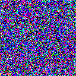
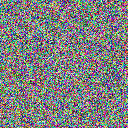
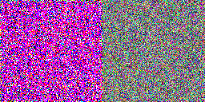

# MOSDAC Cloud Motion Detection System
INSAT-3S Satellite Cloud Motion Detection | MOSDAC Data | Diffusion Model | PSNR/SSIM/MAE Evaluated | GSoC 2026 ML4SCI

**Tanay Bhamare**  
*Electronics & Computer Engineering Student*  
*Pune, India*

---

## Project Overview

This project processes real INSAT-3S satellite imagery from MOSDAC to predict cloud motion patterns using a custom diffusion model architecture. The system analyzes multi-channel satellite data (VIS, IR, WV) and generates actionable weather intelligence including rainfall and thunderstorm alerts.

---

## Live Results

| Predicted Cloud Motion | Ground Truth | Side-by-Side Comparison |
|-----------------------|--------------|------------------------|
|  |  |  |

---

## Core Features

- **Real Satellite Data Pipeline**: Downloads and processes MOSDAC INSAT-3S imagery (VIS/IR/WV channels)
- **Custom Model Architecture**: CloudDenoiseUNet (21→6 channels) + DDPM diffusion process
- **Technical Evaluation**: PSNR, SSIM, MAE metrics on satellite sequence prediction
- **Weather Intelligence**: Automated alerts for rainfall, thunderstorms, high moisture conditions
- **Production Pipeline**: End-to-end inference from satellite frames to weather predictions

---

## System Architecture
INSAT-3S Satellite Images (VIS/IR/WV)
↓
15-frame Sequence Processing (128x128)
↓
CloudDenoiseUNet (21 input → 6 output channels)
↓
DDPM Diffusion Model (1000 timesteps)
↓
Weather Alert Generation


**Technical Details:**
Input: 15 satellite frames (5 VIS + 5 IR + 5 WV)
Model: Custom PyTorch UNet + Diffusion
Output: 6-channel motion prediction + weather classification


---

## Weather Detection Logic

| Weather Event | Detection Method | Satellite Channels |
|---------------|------------------|-------------------|
| Rainfall | IR brightness temperature threshold | IR1, IR2 |
| Thunderstorm | IR-WV temperature differential | IR1 vs Water Vapor |
| High Moisture | Water vapor channel threshold | WV channel |

---

## Repository Contents

mosdac-cloud-motion-detection/
├── mosdac_cloud_model.pth # Trained diffusion model weights
├── predicted_motion.gif # Model output visualization
├── comparison_motion.gif # Predicted vs actual comparison
├── groundtruth_motion.gif # Reference satellite frames
└── mosdac_images/ # Raw INSAT-3S satellite imagery (10 frames)
├── 3SIMG_VIS_L1B_STD.jpg
├── 3SIMG_IR1_TEMP.jpg
└── ... (VIS/IR/WV channels)


---

## Technical Implementation

**Satellite Data Processing:**
- Direct MOSDAC INSAT-3S image retrieval
- Multi-channel alignment (VIS/IR/WV)
- 15-frame temporal sequence construction

**Model Training:**
- Custom CloudDenoiseUNet architecture
- Diffusion model with linear noise schedule
- Sequence-to-sequence cloud motion prediction

**Evaluation Framework:**
- PSNR, SSIM, MAE metrics implementation
- Side-by-side visualization generation
- Weather alert threshold optimization

---

## Quick Setup

```bash
git clone https://github.com/tanay1122/mosdac-cloud-motion-detection
cd mosdac-cloud-motion-detection
pip install torch torchvision pillow numpy matplotlib scikit-image

Satellite machine learning system for cloud motion analysis and weather prediction
tanaybhamare4@gmail.com | Pune, India

t
